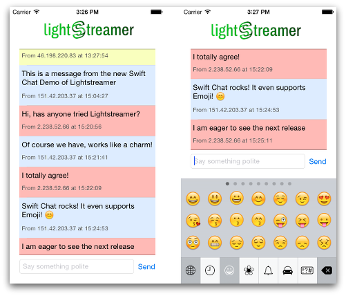

# Lightstreamer - Basic Chat Demo - iOS Client - Swift

<!-- START DESCRIPTION lightstreamer-example-Chat-client-ios-swift -->

The *Chat Demo* is a very simple chat application based on Lightstreamer.

This project contains an example of an application for iPhone that employs the [Lightstreamer iOS Client library](http://www.lightstreamer.com/docs/client_ios_api/index.html).

## Live Demo

### View live demo

**Note! The Live Demo is currently not available, but will be available soon on the App Store.**

## Details

This app, compatible with iPhone, is a Swift version of the [Lightstreamer - Basic Chat Demo - HTML Client](https://github.com/Weswit/Lightstreamer-example-Chat-client-javascript).

This app uses the **iOS Client API for Lightstreamer** to handle the communications with Lightstreamer Server. A simple user interface is implemented to display the real-time messages received from Lightstreamer Server.

Further details about developing Swift Apps on iOS with Lightstreamer are discussed in [this blog post](http://blog.lightstreamer.com/2014/07/developing-swift-apps-on-ios-with.html).

## Build
Binaries for the application are not provided, but a full Xcode 6.0 project specification, ready for a compilation of the demo sources is provided. Please recall that you need a valid iOS Developer Program membership in order to debug or deploy your app on a test device.

To build your own version of the *Basic Chat Demo - iOS Client*, follow these steps.

* Complete this project with the Lighstreamer iOS Client library: 
    * drop into the `Lightstreamer client for iOS/lib` folder of this project the libLightstreamer_iOS_client_64.a file from the `/DOCS-SDKs/sdk_client_ios/lib` of [latest Lightstreamer distribution](http://www.lightstreamer.com/download).
    * drop into the `Lightstreamer client for iOS/include` folder of this project all the include files from the `/DOCS-SDKs/sdk_client_ios/include` of [latest Lightstreamer distribution](http://www.lightstreamer.com/download).

### Deploy

With the current settings, the demo tries to connect to the demo server currently running on Lightstreamer website.
The demo can be reconfigured and recompiled in order to connect to the local installation of Lightstreamer Server. You just have to change SERVER_URL, as defined in `SwiftChat/ViewController.swift`; a ":port" part can also be added.
The example requires that the [Lightstreamer - Basic Chat Demo - Java Adapter](https://github.com/Weswit/Lightstreamer-example-Chat-adapter-java) and [LiteralBasedProvider Metadata Adapter](https://github.com/Weswit/Lightstreamer-example-ReusableMetadata-adapter-java#literalbasedprovider-metadata-adapter) have to be deployed in your local Lightstreamer server instance. *The factory configuration of Lightstreamer server already provides the LiteralBasedProvider Metadata Adapter deployed.*

## See Also

* [Developing Swift Apps on iOS with Lightstreamer ](http://blog.lightstreamer.com/2014/07/developing-swift-apps-on-ios-with.html)

### Lightstreamer Adapters Needed by This Client

* [Lightstreamer - Basic Chat Demo - Java Adapter](https://github.com/Weswit/Lightstreamer-example-Chat-adapter-java)
* [LiteralBasedProvider Metadata Adapter](https://github.com/Weswit/Lightstreamer-example-ReusableMetadata-adapter-java#literalbasedprovider-metadata-adapter)

### Related Projects

* [Lightstreamer - Basic Chat Demo - HTML Client](https://github.com/Weswit/Lightstreamer-example-Chat-client-javascript)
* [Lightstreamer - Basic Stock-List Demo - iOS Client](https://github.com/Weswit/Lightstreamer-example-StockList-client-ios)

## Lightstreamer Compatibility Notes

* Compatible with Lightstreamer iOS Client Library version 1.2 or newer.
* For Lightstreamer Allegro (+ iOS Client API support), Presto, Vivace.
